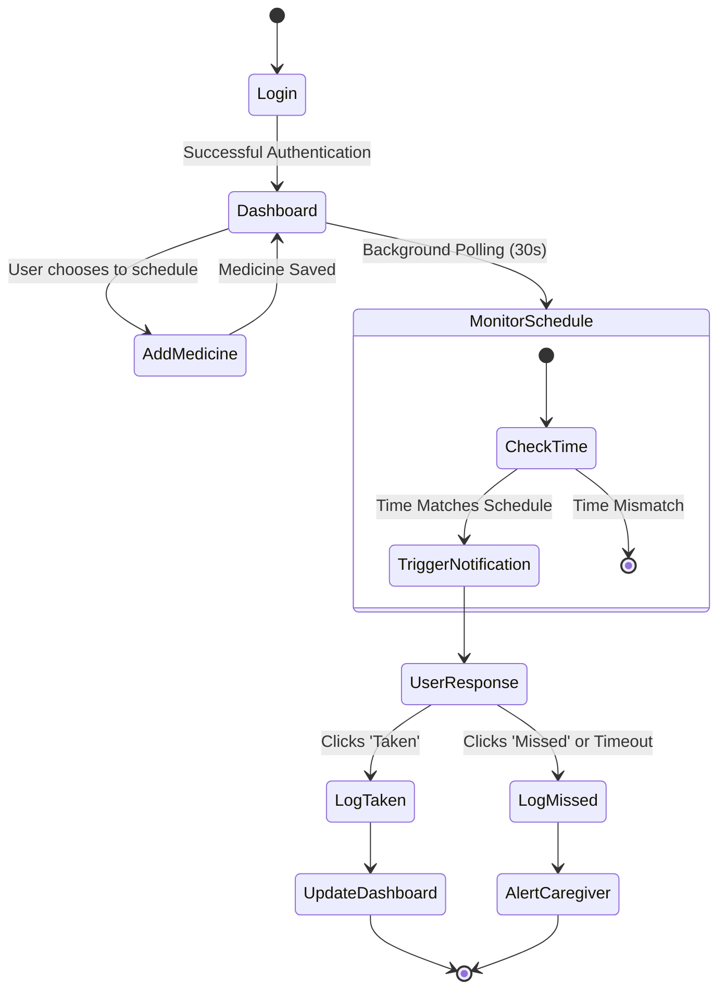
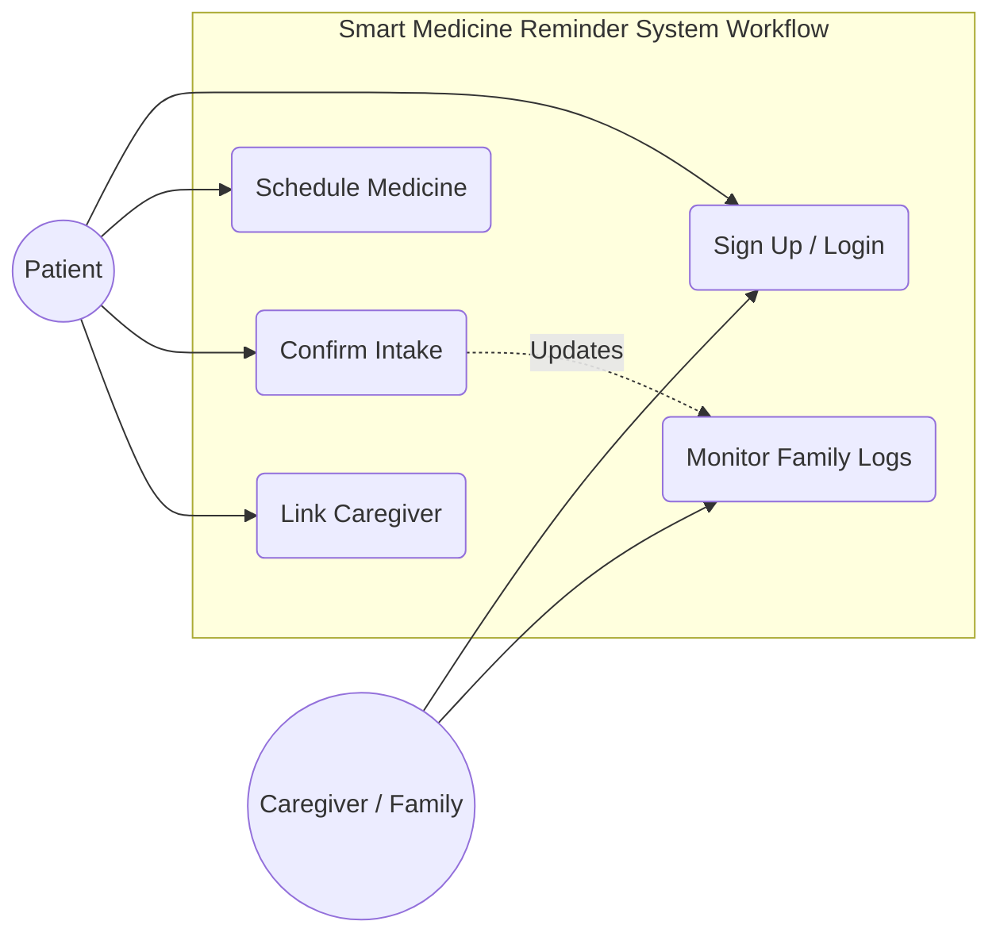
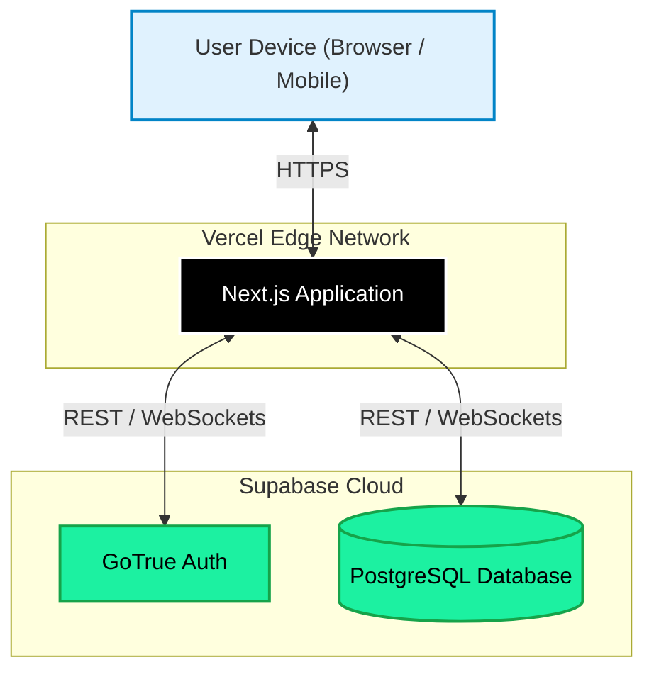

# Project Report: Smart Medicine Reminder System

---

## 1. Abstract
Medication non-adherence is a major global healthcare challenge, especially for elderly individuals and chronic patients, leading to severe health complications and substantial economic burdens. The **Smart Medicine Reminder System** is an accessible, modern, web-based solution designed to address memory-based non-adherence. Developed using a robust technology stack featuring **Next.js 15**, **Tailwind CSS**, and **Supabase**, the system simplifies medication scheduling and tracks intake with real-time browser notifications. A key differentiator of this system is its **twinning architecture**, which connects patients with their designated caregivers. When a patient confirms medication intake, logs are updated in real-time. If a dose is missed, caregivers are immediately notified, enabling prompt intervention.

---

## 2. Introduction
The digital health landscape has experienced rapid growth, empowering patients to take control of their health. The Smart Medicine Reminder System bridges the gap between patient independence and caregiver support. Medication non-adherence is often called a "silent epidemic," responsible for numerous hospital admissions and avoidable costs. Existing solutions often fail due to complexity for elderly users or lack of remote accountability. The key objectives of this project are to develop an elderly-friendly UI, ensure real-time tracking, implement caregiver twinning, and create automated adherence activity logs.

---

## 3. Literature Survey
To build a reliable system, several recent studies in digital health interventions were analyzed:
1.  **memorAIs (Shaveet et al., 2023)**: Highlights the importance of automated input methods (such as OCR) in reducing data entry errors for elderly users.
2.  **Patient-caregiver twinned mobile phone application (Tan et al., 2024)**: Validates linking patient activity logs directly to family member dashboards to establish social support and accountability.
3.  **Digital interventions in medication adherence (Moon & Walsh, 2025)**: Emphasizes addressing age-related accessibility and digital literacy barriers with simple, high-contrast layouts.
4.  **Evaluating the Effectiveness of Mobile Apps (Lanke et al., 2025)**: Proves that app-based reminders consistently improve clinical scores for chronic conditions.
5.  **IoT Based Smart Medicine Reminder System (Navandar et al., 2025)**: Serves as a reference for future hardware-software integration using IoT pillboxes.

---

## 4. Problem Statement
> "Traditional healthcare management systems fail to ensure consistent medication adherence due to age-related cognitive decline, complex regimens, and the isolation of patients. Existing digital reminders are either overly complex, require manual input that introduces errors, or lack a feedback loop to notify care circles when a dose is missed. The goal of this project is to develop a highly accessible web application that automates scheduling, tracks real-time intake compliance, and twins patient accounts with caregivers to guarantee timely, life-saving interventions."

---

## 5. Methodology

### i. Requirement Analysis
The system requirements were gathered to ensure the application meets the needs of its target demographics:
*   **Functional Requirements**: User authentication (patients and caregivers), CRUD operations for medication schedules, real-time trigger of reminders, logging of 'Taken' or 'Missed' statuses, and linking caregiver accounts to patient profiles.
*   **Non-Functional Requirements**: High accessibility (large fonts, high contrast), responsiveness across mobile and desktop devices, low latency for real-time notifications, and secure data storage.

### ii. System Design & Architecture
The system employs a client-server architecture. The frontend is a Single Page Application built with Next.js, communicating with Supabase for backend services (Database, Auth, Realtime).

#### Activity Diagram
The following diagram illustrates the flow of activities from the moment a user interacts with the system:

### iii. Workflow Modelling
Workflow modeling ensures seamless interaction between the two primary roles: Patient and Caregiver.

### iv. System Development
The application utilizes a curated, state-of-the-art tech stack:
*   **Next.js 15 (App Router) & React 19**: Component-driven UI, state management, and optimized rendering.
*   **Tailwind CSS & Shadcn UI**: Modern, responsive styling with accessible components.
*   **Supabase**: Backend-as-a-Service providing PostgreSQL, JWT authentication, and real-time database subscriptions.
*   **Client-Side Notification Engine**: Custom polling engine `NotificationChecker.tsx` that evaluates times and prevents duplicate alerts.

### v. Testing & Validation
Testing was conducted iteratively:
*   **Unit Testing**: Isolated testing of UI components (Shadcn cards, forms) for proper rendering.
*   **Integration Testing**: Verifying the Next.js frontend properly communicates with Supabase APIs for CRUD operations.
*   **Functional Testing**: Ensuring the `NotificationChecker` triggers toasts accurately when local time matches scheduled time.
*   **Accessibility Testing**: Contrast checks and target-size validations for elderly users.

### vi. Deployment & Maintenance
The application is designed for cloud-native deployment. The frontend is hosted on Vercel, providing edge-network delivery and CI/CD pipelines. The backend relies on Supabase's managed cloud infrastructure.

#### Deployment Diagram

---

## 6. Result Analysis

### i. Improved Workflow Efficiency
Automated scheduling replaces manual tracking methods (pillboxes, paper logs). The continuous background monitoring ensures users do not have to actively remember their schedules, vastly improving daily routine efficiency.

### ii. Reduction in Errors and Data Loss
By centralizing schedules in a PostgreSQL database, the risk of losing physical prescriptions or forgetting complex dosages is minimized. Supabase ensures high data durability and availability.

### iii. User-Friendly Interface
In compliance with age-friendly design patterns, the UI utilizes `slate` tones and high-contrast text to minimize eye strain. Large touch targets (minimum 48x48 pixels) accommodate users with tremors, and color-coded cues (Green for Taken, Red for Missed) enhance usability.

### iv. Secure and Role-Based Access
Supabase Authentication guarantees secure access. Role separation ensures Patients only modify their own schedules, while Caregivers have read-only access to specific linked patient logs, maintaining privacy and security.

### v. Accurate Record Management
Every action triggers an entry in the `logs` table. This automated logging provides an indisputable historical record of adherence, which is invaluable during medical consultations.

### vi. Faster Decision Making and Transparency
The core "twinning" feature ensures that the moment a patient logs a "Missed" dose (or ignores a prompt), the caregiver's dashboard updates in real-time. This transparency allows for immediate intervention, preventing adverse health events.

---

## 7. Future Scope
1.  **Prescription OCR Scanning**: Integrating Cloud Vision API so patients can auto-populate schedules by photographing pharmacy labels.
2.  **Voice-Assisted Alerts**: Utilizing Web Speech API to read reminders aloud for visually impaired users.
3.  **IoT Pillbox Integration**: Syncing physical pillboxes equipped with ESP32 microcontrollers to the web dashboard to automatically record when a compartment is opened.

---

## 8. Conclusion
The Smart Medicine Reminder System provides a functional, secure, and user-centric solution to the persistent challenge of medication non-adherence. By leveraging Next.js 15 and Supabase, the system achieves low latency, secure authentication, and real-time synchronization. The caregiver-twinning architecture effectively addresses the logistical and emotional barriers of remote care, ensuring family members are always informed. The project represents a scalable and impactful step forward in digital health interventions.

---

## 9. References
1.  Shaveet, E., et al. (2023). **memorAIs: an Optical Character Recognition and Rule-Based Medication Intake Reminder-Generating Solution**. *Columbia University DivHacks Proceedings*.
2.  Tan, N. C., et al. (2024). **Patient-caregiver twinned mobile phone application to promote medication adherence**. *Proceedings of Singapore Healthcare*.
3.  Moon, Z., & Walsh, J. (2025). **Digital interventions in medication adherence: a narrative review of current evidence and challenges**. *Frontiers in Digital Health*.
4.  Lanke, V., et al. (2025). **Evaluating the Effectiveness of Mobile Apps on Medication Adherence for Chronic Conditions**. *Journal of Medical Internet Research (JMIR)*.
5.  Navandar, R. K., et al. (2025). **IoT Based Smart Medicine Reminder System with RFID Authentication**. *IRJMETS*.
